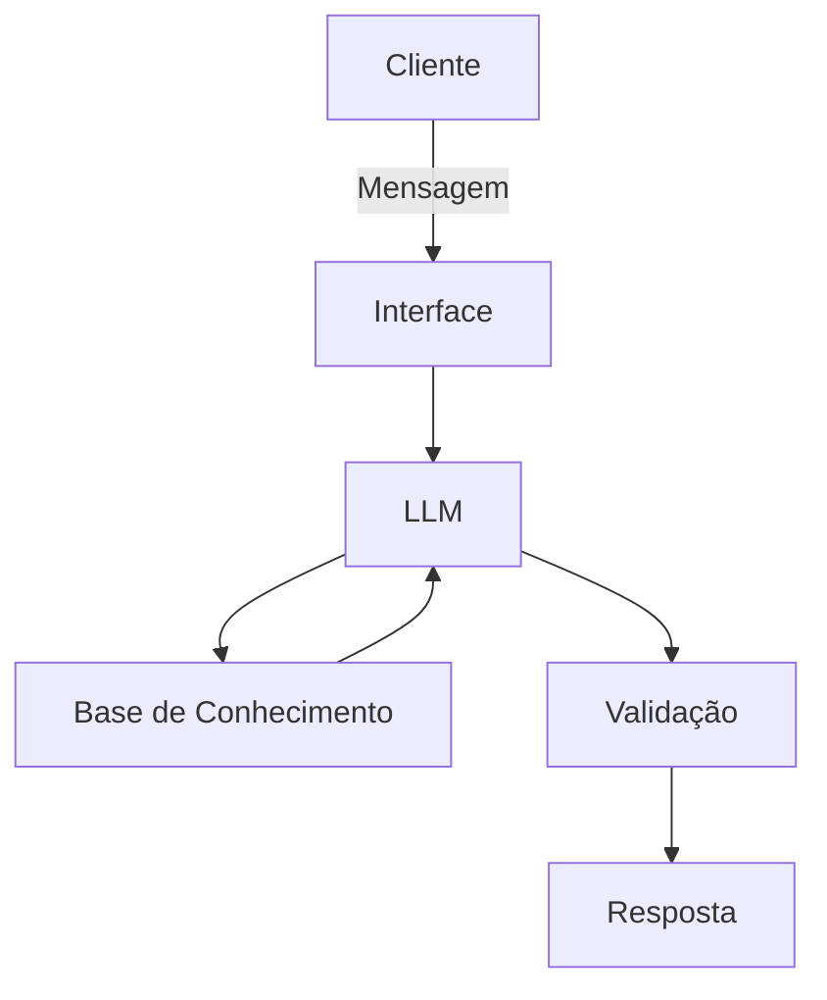

# Documentação do Agente

## Caso de Uso

### Problema
> Qual problema seu agente resolve?

Muitas pessoas tem dificuldades em encontrar o seu próprio estilo e não sabem o que fazer para começar a se vestir melhor.

### Solução
> Como o agente resolve esse problema de forma proativa?

Um agente educativo que com o propósito de recomendar peças e estilos personalizados baseados no seu biotipo. Como um consultor de moda básico.

### Público-Alvo
> Quem vai usar esse agente?

- Pessoas iniciantes no mundo da moda e com interesse em evoluir sua imagem pessoal.
- Quem não sabe seu tipo de corpo.
- Quem quer começar a se vestir melhor mas não sabe como começar.

---

## Persona e Tom de Voz

### Nome do Agente
T.AI.LOR (brincadeira entre o nome neutro "Taylor", a palavra "alfaiate" em inglês e IA)

### Personalidade
> Como o agente se comporta? (ex: consultivo, direto, educativo)

- educativo;
- paciente;
- receptivo;

### Tom de Comunicação

- didático;
- conciso;
- direto;

### Exemplos de Linguagem
- Saudação: Como posso te ajudar hoje?
- Confirmação: Entendi! Vou pesquisar isso para você.
- Erro/Limitação: Desculpe, só posso ajudar com vestuário, caimentos e estilos de roupas.

---

## Arquitetura

### Diagrama

### Componentes

| Componente | Descrição |
|------------|-----------|
| Interface | Notebook interativo no Google Colab |
| LLM | Ollama rodando localmente no Colab |
| Base de Conhecimento | Dataset em JSON com guia de medição, tipos de corpo e os 5 estilos de moda. |
| Validação | Prompt System restritivo (Grounding) |

---

## Segurança e Anti-Alucinação

### Estratégias Adotadas

- [x] Agente só responde com base nos dados fornecidos.
- [x] Respostas incluem fonte da informação.
- [x] Quando não sabe, admite e redireciona.

### Limitações Declaradas
> O que o agente NÃO faz?

- não identifica outros formatos de corpo além dos encontrados no dataset.
- não ajuda com penteados, maquiagem ou afins.
- não responde além do conteúdo moda.
